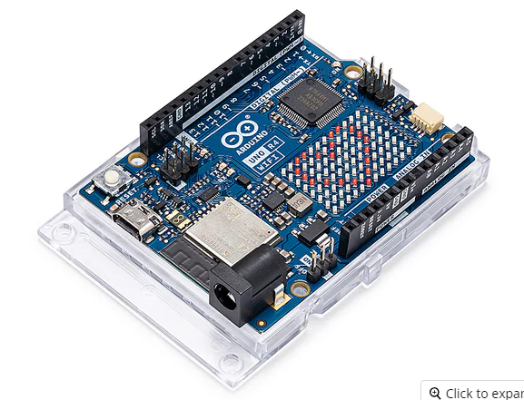
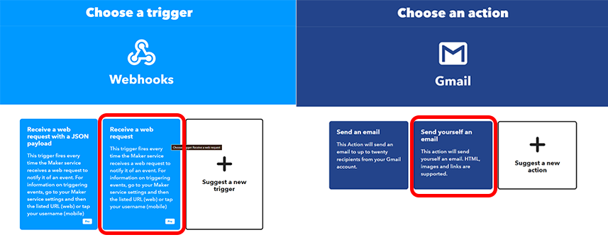
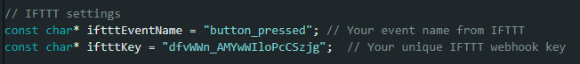
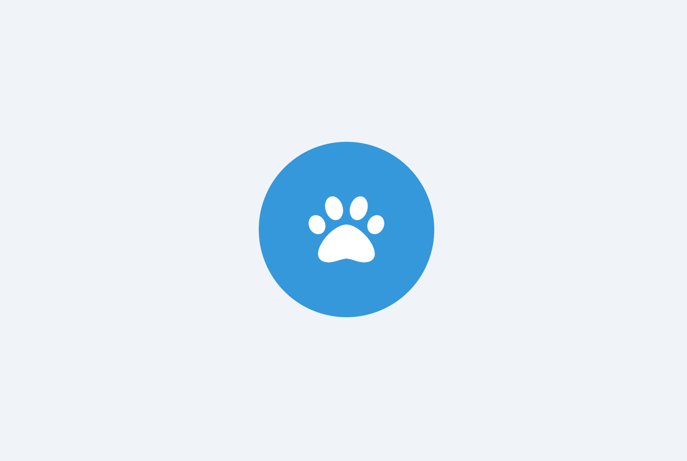
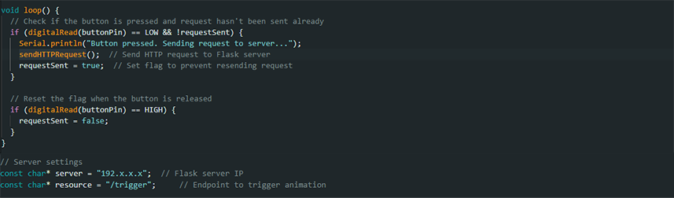
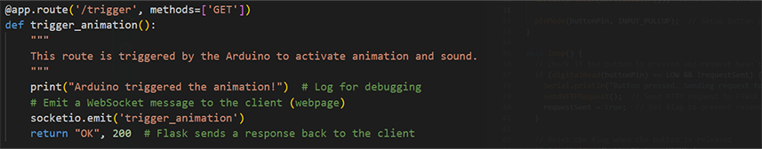
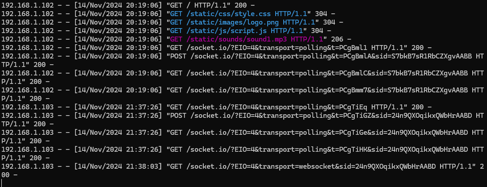
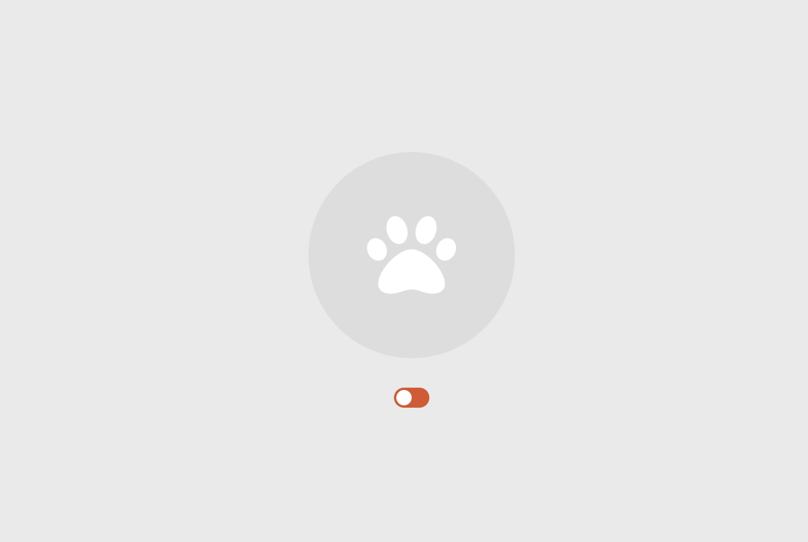
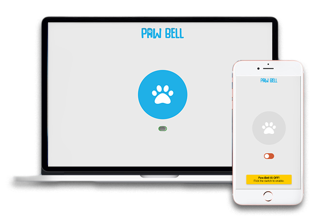
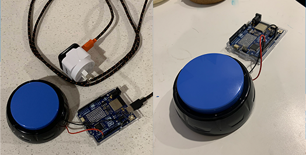

## DES222 - Task 2: Process Journal

This project focuses on addressing a common challenge that all dog owners face: toilet training. Specifically, it's aimed at those who live in small apartments or townhouse complexes where access to a yard isn't readily available for their canine companion.

Introducing the Paw Bell: a doorbell for dogs that connects to your Wi-Fi network, sending notifications directly to your mobile device. This helps train your dog to signal when it’s time to “go,” ensuring you're always aware—no matter where you are in the house.

## Research

### Product 1 - Pet Talking Buttons
The most basic version of a dog doorbell, these buttons play a sound through a built-in speaker when pressed. A notable feature is the ability to record custom sounds or voice cues. However, the downside is the lack of volume control, which means the effectiveness depends entirely on the owner's ability to hear the sound. This can make training difficult, especially if the button is located in another room or out of earshot (as seen in the image above).

### Product 2 - Smart Bell by Mighty Paw
This product builds on the basic button design by adding a receiver that plugs into a wall outlet. When one of the connected buttons is pressed, the receiver plays a tone. The buttons act as transmitters and don't require charging or batteries because they use a micro-generator, which creates enough power when pressed to send a signal. However, a limitation of this system is that the receiver and buttons must be within range of each other, and interference or distance can reduce its reliability.

### Product 3 - Echo Buttons
Although not designed for pets, Echo Buttons interact with Alexa and other compatible Echo devices to trigger Smart Home routines or play games. These buttons use two AAA batteries and can connect up to four devices via Bluetooth. They’ve since been discontinued, as most of their functions can be performed through apps or voice commands, making them largely redundant.

### Concept

    Since dogs can’t use smartphones or give voice commands, a button system is an ideal way for them to interact with technology. My goal is to combine the concepts from the products above to create a dog bell that alerts owners when they’re less likely to notice their pet—like when they’re listening to music or working on a computer.

The button will connect to the home Wi-Fi and trigger a response that’s sent to a webpage, either on your computer or phone.

## Pre-Development

Before I could get started on making the product I decided figure out exactly what components and materials I needed. 

Since the talking buttons (from Product 1) came in a four pack I was able to dissasemble one to see if I can reuse the button for my
prototype. The button is the perfect size and dosn't require a lot of downward pressure to activate.

At first I was going to use the Micro:Bit and an ESP-01 wifi module to connect to a network and send a HTTP request to a web interface. However after
some research I found a better all in one solution.

This Wi-Fi board features flash memory to send a request to an external service acting as a webhook that will call when the button is pressed.

**How it might work?**
1. ESP8266 Setup: When the button is pressed, the ESP8266 sends an HTTP request to an external webhook.
2. Webhook Service: Use a service like IFTTT, Zapier, or a custom backend (like Firebase Functions) to receive the request.
3. Webpage on GitHub: The webpage uses JavaScript to periodically check for notifications or to listen for an event and play the sound when notified.

**Possible Issues**

- Battery Life: To send requests to the web, the button will need a constant Wi-Fi connection, which could lead to quicker battery depletion.
I need to experiment with 'sleep' modes to ensure the device is only on when needing to send data.

- Accessibility: The website receiving the notification will need to remain open to ensure the message is received in real-time. 
Also due to the limitations of GitHub Pages (being static), we can't directly have the ESP8266 communicate with it in real time.
The use of IFTTT as a bridge should allow us to bypass this limitation by leveraging external services.

## Development
At this stage it was time to get something working. It was clear no amount of Youtube videos was going to make me completely understand how I was going to tackle this project, but I knew that for my first project it wasn't going to be a straight shot.
For that reason, after walking around JayCar for 30 minutes I changed my mind and ended up purchasing a board that was a more beginner friendly 'all-in-one' - The Arduino UNO R4 WiFi. 

I opted for this microcontroller over the micro-bit/ESP wifi module as I was worried about the extra steps in flashing the ESP-01 and programming for it using micro-bit's make code. I had seen a lot of community content online regarding programming in the Arduino IDE and I was a lot more comfortable being able to plug in the R4 and get started straight away. There was a flaw to this decision however, but I'll touch on that later.

**Getting Something Working**

The first step was getting the Arduino connected to my wifi. Luckily the Arduino IDE comes with built in examples on how to do this, specific to the board manager installed. After getting an understanding of how it all works I was able to successfully get my R4 online. From here I wanted to try and incorporate a simple webhook that would send me an email when I pressed a button. To do this I used IFTTT.

After subscribing to the IFTTT event name and giving the provided key to the Arduino I was able to get this working relitivly easy. At this point I was nieve and thought I could just use this same method for my project, but the more I learnt, the less I knew. Knowing that I had to run my app on a server I delved into flask and hit dead end after dead end trying to get webhooks triggering on my webpage. I decided to take a break and turn my attention to something I'm more confortable with - designing.

**Web App Design**

I wanted the design of my interface to be simple and easy to understand. I setup a html template for flask (which was probably redundant given it's only one page) and started working on a simple prototype. Using javascript I listened for when the spacebar was pressed, that would trigger an animation and sound effect. This was so I could ensure everything looked and felt good before I replaced the user input with a GET request for when I finally get it working.

**Server Setup**

I lost track of a lot of things I had tried at this point, so I'll just tell you what worked.

As much as I wanted this website to be online I lacked the skills in making the system secure - as I wasn't working in a virtual environment and didn't feel comfortable with what I don't know. Instead I setup a local host using phython/flask and ran it on all network interfaces (hosting on 0.0.0.0), making it accessable via the local IP address and other devices (such as the Arduino). I also found out what Websockets are, which I wish I knew about from the beginning. Once a Websocket connection is established it allows the client continous exchange of messages to the server in real time - which is perfect for my device.

Over to the Arduino IDE, I plugged in the flask server IP and the GET method to trigger the function in the python app code.

Sorry for the mess, a lot of the code is still left in from debugging and I'm too scared to touch it. You have no idea how happy I was to see this in the server console:

**Mo' Features, Mo' Problems**

While the server was reciving the input from the Arduino over wifi, the button animation and sound was not playing on the webpage. This was because I had never actually checked for the trigger in the javascript. All I needed to do was create a Websocket connection to flask and listen for the trigger in order to call the same animation and sound function I had previously tested with the space bar. After doing this the animation worked!

But there was a new issue. I was getting an error in the browser console about the sound - aparently the user has to interact with the page when loaded to enable sounds to be played (ie mouse click, button press). I solved this by adding a switch the user has to press before the button is active. Later on I added a popup that displays when the bell is turned off to give the user some direction.

Another probelm with the sound was when using the app on my iPhone. I tried to be smart and use .ogg format for the sounds (to save 10KB??) but turns out the format isn't supported by safari so I just used .mp3 instead.

**Putting It All Together**

It was done, the server was running on my local network and I could access it from any device. Here it is in action:

Unfortunately, due to the size of the microcontroller I had chosen I couldn't fit it into the button I had originally gutted for this project and it was too late into to find or even think about 3D printing a new one. This is dissapointing as it is something that I would love to be using, but being left on the ground, it would only end up as an expensive chew toy for my dog.

**The Future**

I will be continueing this project in my free time - as I come to understand the inner workings of this device and the bare minimum I would need to pull this off again, I am confident I can reduce the footprint of it quite a lot - hopefully enough to fit inside a button with a battery pack. The other issue I mentioned earlier about power usage still looms but if there's anything I've leanrt from this project it's that problems are just stepping stones to understanding and an opportunity for growth.

By for now,
Tom.