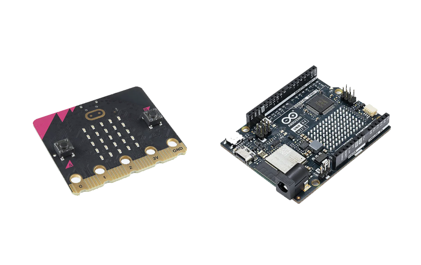

## DES222 - Task 2: Process Journal

This project focuses on addressing a common challenge that all dog owners face: toilet training. Specifically, it's aimed at those who live in small apartments or townhouse complexes where access to a yard isn't readily available for their canine companion.

 

    Introducing the Paw Bell: a doorbell for dogs that connects to your Wi-Fi network, sending notifications directly to your mobile device. This helps train your dog to signal when it’s time to “go,” ensuring you're always aware—no matter where you are in the house.

## Research

### Product 1 - Pet Talking Buttons
The most basic version of a dog doorbell, these buttons play a sound through a built-in speaker when pressed. A notable feature is the ability to record custom sounds or voice cues. However, the downside is the lack of volume control, which means the effectiveness depends entirely on the owner's ability to hear the sound. This can make training difficult, especially if the button is located in another room or out of earshot (as seen in the image above).

### Product 2 - Smart Bell by Mighty Paw
This product builds on the basic button design by adding a receiver that plugs into a wall outlet. When one of the connected buttons is pressed, the receiver plays a tone. The buttons act as transmitters and don't require charging or batteries because they use a micro-generator, which creates enough power when pressed to send a signal. However, a limitation of this system is that the receiver and buttons must be within range of each other, and interference or distance can reduce its reliability.

### Product 3 - Echo Buttons
Although not designed for pets, Echo Buttons interact with Alexa and other compatible Echo devices to trigger Smart Home routines or play games. These buttons use two AAA batteries and can connect up to four devices via Bluetooth. They’ve since been discontinued, as most of their functions can be performed through apps or voice commands, making them largely redundant.

### Concept
Since dogs can’t use smartphones or give voice commands, a button system is an ideal way for them to interact with technology. My goal is to combine the concepts from the products above to create a dog bell that alerts owners when they’re less likely to notice their pet—like when they’re listening to music or working on a computer.

The button will connect to the home Wi-Fi and trigger a response that’s sent to a webpage, either on your computer or phone.

**Possible Issues**

- Battery Life: To send requests to the web, the button will need a constant Wi-Fi connection, which could lead to quicker battery depletion.

- Accessibility: The website receiving the notification will need to remain open to ensure the message is received in real-time.

## Pre-Development

Using the talking buttons (Product 1) 

